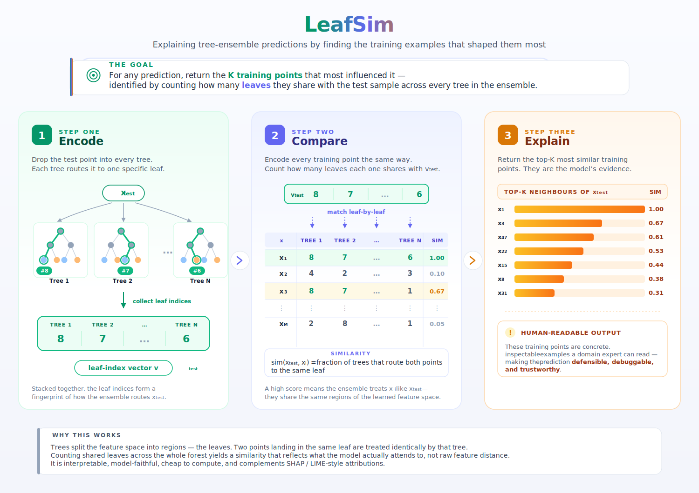
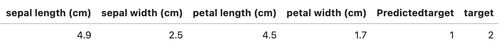
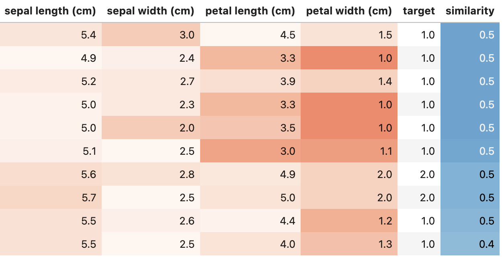

# LeafSim

`leafsim` identifies **which training examples most influenced a model's prediction**. It is an example-based **explainable AI (XAI)** technique for decision tree based ensemble methods.

LeafSim is most useful when you need to explain a prediction to someone who understands the training data. 
In general, when explaining predictions to a domain expert who can judge whether the retrieved examples are reasonable analogues for the case at hand.

It complements feature-attribution methods (SHAP, LIME) rather than replacing them. Where SHAP answers *"which features drove this prediction?"*, LeafSim answers *"which training examples drove this prediction?"* — both perspectives are often needed.
The technique is:
- easy to interpret by non-technical domain experts
- complementary to feature-attribution methods like SHAP and LIME
- straightforward to implement and maintain in production
- computationally lightweight

More details can be found in [this blog post](https://datascience.ch/leafsim/) and the version accompanied by code found [here](https://sdsc-innovation.github.io/leafsim/).

# How it works



**Summary**

LeafSim works by tracking which leaf node each sample lands in across every tree of the ensemble. Samples that consistently land in the same leaves are considered similar, because they followed the same sequence of decision rules through the forest. Similarity is measured as Hamming distance over those leaf indices, and the closest training samples are returned as the explanation.

The result is a human-readable answer to the question: *"which past cases does the model consider most similar to this new input?"*

**Example**

As an example, consider explaining the prediction for this Iris flower observation (see [notebook](notebooks/Simple_Example/Example.ipynb)):



Using LeafSim, we identify the N training observations the model most relied on when making the prediction `predictedtarget`. The top 10 look like this:



where `target` is the ground-truth label and `similarity` the LeafSim score ranging from 0 (no similarity at all) to 1 (exactly the same features $x$ and target $y$).

In this example, the model makes an incorrect prediction because many of the most similar training observations carry a different target label — LeafSim makes this failure mode visible.

# Installation

Install from source to ensure the latest version:

```commandline
git clone https://github.com/calyptis/leafsim
uv sync                          # core library only
uv sync --group notebooks        # include notebook dependencies (pandas, matplotlib, seaborn)
```

# Usage example

A complete example is available in this [notebook](notebooks/Simple_Example/Example.ipynb). Below is a quick-start:

```python
from leafsim import LeafSim
from sklearn.ensemble import RandomForestClassifier
from sklearn.datasets import load_iris
from sklearn.model_selection import train_test_split

data = load_iris(as_frame=True)
X_train, X_to_explain, y_train, _ = train_test_split(
    data["data"], data["target"], test_size=0.2, random_state=46
)

model = RandomForestClassifier()
model.fit(X_train, y_train)

leafsim_instance = LeafSim(model)
explanation_ids, explanation_similarities = leafsim_instance.generate_explanations(
    X_train, X_to_explain, top_n=10
)
# explanation_ids:         shape (n_test, top_n) — indices into X_train
# explanation_similarities: shape (n_test, top_n) — LeafSim score in [0, 1]

# Retrieve the 10 most similar training examples for the first test observation
X_train.iloc[explanation_ids[0]]

# And their corresponding similarities [0, 1]
# with 1 => having equivalent features & labels
explanation_similarities[0]
```

# Tests

```commandline
uv run pytest tests/
```

# Related work

LeafSim belongs to the family of **example-based (case-based) explanations** — methods that explain a prediction by reference to similar known cases rather than by attributing importance to individual features. This paradigm traces back to Case-Based Reasoning (Aamodt & Plaza, 1994).

**Conceptually similar approaches**

For gradient-based training-data influence on arbitrary models, see [influence functions](https://arxiv.org/abs/1703.04730) (Koh & Liang, 2017) and [TracIn](https://arxiv.org/abs/2002.08484) (Pruthi et al., 2020). These answer the same question as LeafSim — which training examples most influenced this prediction.

**Tools following similar/complementary approaches**

| Tool | Explanation type | Key question answered |
|------|------------------|-----------------------|
| [SHAP / TreeSHAP](https://github.com/shap/shap) | Feature attribution | Which features drove this prediction? |
| [LIME](https://github.com/marcotcr/lime) | Local linear surrogate | Which features matter locally? |
| [ELI5](https://github.com/eli5-org/eli5) | Feature weights | How does this model use each feature? |
| LeafSim | Example-based | Which training examples drove this prediction? |

# Structure of repo

- `leafsim/` — the Python library
- `notebooks/` — usage examples (simple Iris classification and advanced car-price regression)

# Further resources

For a more comprehensive usage example, refer to this [blog post](https://sdsc-innovation.github.io/leafsim/) and the corresponding [notebook](notebooks/Advanced_Example/Example.ipynb).

# Citation

If you use this software in your work, it would be appreciated if you would cite it using the following BibTeX reference:

```
@software{leafsim,
  author = {Lucas Chizzali},
  title = {LeafSim: Example based XAI for decision tree ensembles},
  url = {https://github.com/calyptis/LeafSim},
  date = {2022-11-14},
}
```
