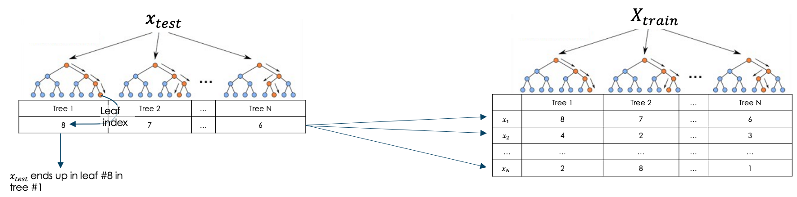

# Leafsim

`leafsim` is an example-based **explainable AI** (**XAI**) technique for decision tree based ensemble methods.<br/>
The process applies the Hamming distance on leaf indices to measure similarity between predictions on wishes to explain in the test and training set.<br/>
It therefore explains model predictions by identifying training data points that most influenced a given prediction.

The proposed technique is:
- easy to interpret by non-technical people
- complementing existing XAI techniques
- straightforward to implement & maintain in production
- computationally lightweight

More details can be found in [this blog post](https://datascience.ch/leafsim/) and the version accompanied by code found [here](https://calyptis.github.io/LeafSim/).

# Installation

Install from [PyPI](link):

```commandline
pip install leafsim
```

Or install from source, to ensure latest version:

```commandline
pip install git+https://github.com/calyptis/LeafSim
```

# Usage example

A complete yet simple example is available in this [notebook](notebooks/Simple_Example/Example.ipynb).
Below is a "quick start" example:

```python
# ----- Environment
from leafsim import LeafSim
from sklearn.ensemble import RandomForestClassifier
from sklearn.datasets import load_iris
from sklearn.model_selection import train_test_split


# ----- Data
data = load_iris(as_frame=True)
X = data["data"]
y = data["target"]
X_train, X_to_explain, y_train, _ = train_test_split(
    X, y, test_size=0.2, random_state=46
)

# ----- ML model
model = RandomForestClassifier()
model.fit(X_train, y_train)

# ----- LeafSim
leafsim_instance = LeafSim(model)
top_n = 10  # Number of explanations per data-point
explanation_ids, explanation_similarities = leafsim_instance.generate_explanations(
    X_train, X_to_explain, top_n=top_n
)
# explanation_ids:
#    - Shape: (len(X_to_explain), top_n)
#    - Values: Indices of most similar data points in X_train
# explanation_similarities:
#    - Shape: (len(X_to_explain), top_n)
#    - Values: Similarity score of corresponding data points referenced in explanation_ids

# ----- XAI
# Explaining prediction of first observation in X_to_explain
idx = 0
# 10 most relevant observations from the training set that influenced
# the model prediction for X_to_explain[idx]
explanations_for_idx = explanation_ids[idx]
# And their corresponding similarities
similarities_for_idx = explanation_similarities[idx]

# Accessing the data points that act as explanations (and their features)
X_train[explanations_for_idx]
```

# Details

The Model prediction of a given observation is explained by identifying data points in the training data
that end up most often in the same leaf across trees in the ensemble model.
This is visualised in the figure below, where $x_{test}$ is the observation one wishes
to explain.



As an example, consider explaining the prediction of this observation of an Iris flower (see [notebook](notebooks/Simple_Example/Example.ipynb)):


Using LeafSim, we can identify N training observations on which the model relied on the most when making a prediction.
For example, the Top 10 look like this:


In this example, the model fails to make a correct prediction.
This is because many of the training observation with similar features actually have a
target different from the observation for which we wish to explain the prediction.

# Structure of repo

- `notebooks/` contains a usage examples of LeafSim (simple and advanced)
- `leafsim/` contains the Python code that constitutes the library

# Further resources

For a more comprehensive usage example, please refer to this [blog post](https://calyptis.github.io/LeafSim/) and the corresponding [notebook](notebooks/Advanced_Example/Example.ipynb).

# Citation

If you use this software in your work, it would be appreciated if you would cite this tool, for instance using the following Bibtex reference:

```
@software{leafsim,
  author = {Lucas Chizzali},
  title = {LeafSim: Example based XAI for decision tree ensembles},
  url = {https://github.com/calyptis/LeafSim},
  version = {0.6.0},
  date = {2022-11-14},
}
```
